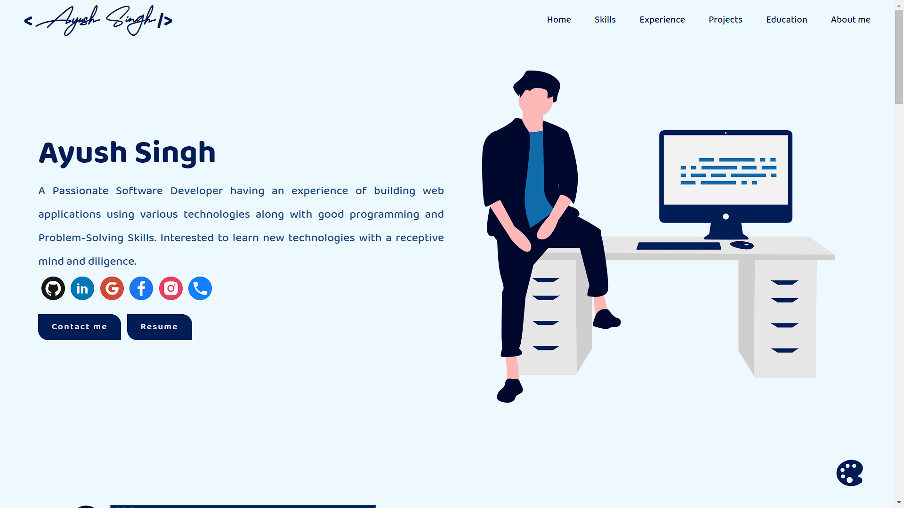

<h1 align="center"> Portfolio Website for a Software Developer🔥 </h1> 
<h3 align="center"> A clean, beautiful, fully interactive and responsive portfolio template for a Developer!</h3>

<p  align="center">Link to access the Website <a href="http://ayushsingh11.web.app">http://ayushsingh11.web.app</a></p>

<p align="center"> 
    <a href="https://ayushsingh11.web.app" target="_blank">
    </img>
  </a>
</p>

# Key Points 📋

- The website is completely built on `react-js`, a library of `javascript` along with `sass` and `styled-components` for styling.
- This website is fully responsive and all the data are present in a single file. Thereby, you just need to change the data at one place and all the corresponding changes with happen.
- This website is both a single page portfolio website as well as multi-page portfolio website. All main informations are present on the `Home` page and if you want to know more, you can click at `View More` button present there which will take you to the corresponding page, which contains extra details about a particular section. You can also access those pages from the header.
- To the bottom right, there is a color pallete icon, which on click opens a modal where you can choose a theme of your choice. There are various options and the default theme is Blue theme.
- `redux` has been used for storing and managing the theme data.
- For deployment `firebase` has been used.

# Sections 📚

✔️ Summary and About me\
✔️ Skills\
✔️ Experience\
✔️ Projects\
✔️ Education

# Clone and use ✏️

- Install `nodejs` and `npm`, try to install versions which are equal or greater than the versions present in this project, which is `npm - 6.14.13` and `nodejs - 14.17.0`.
- After the successful installation of `nodejs` and `npm`, clone the repository into your local system using below command:
  - ```python
     git clone https://github.com/ayushazuri/Portfolio-Website.git
    ```
  - This will clone the whole repository in your system.
- To download required dependencies to your system, navigate to the directory where the cloned repository resides and execute following command:
  - ```python
    npm install
    ```
- The project is now ready to use. type `npm start` in your terminal and the website will open on you `localhost:3000`.
- All the data are present in `portfolio.js`. Add all of your data in that file and see the results.
- For adding images like Profile picture, project photos, etc, do the following:
  - Add your image in `src/assets/Images/` (Preferred Location).
  - Add the path to that image in your `portfolio.js` in this format.
    ```javascript
      link: require("./assets/Images/image.jpeg).default;
    ```
  - This way you will be able to use the image.
- Try and explore new things. Add new feature or modify the existing one.

# Change Theme 🌈

You can add new themes as well. There are various themes already present in the website which makes the website looks amazing. I usually prefer using Blue theme or Torqouise Theme. All the Themes available are:
<br></br>
🔹 Blue Theme\
 🔹 Torquoise Theme\
 🔹 Orange Theme\
 🔹 Violet Theme\
 🔹 Pink Theme\
 🔹 Maroon Theme\
 🔹 Green Theme\
 🔹 Plum Theme\
 🔹 Purple Theme
<br></br>
You can add more themes by adding the color palatte in the `theme.js` file. Add the object with the details same as the other color palatte and then pass the object in the exported array. Themes are being changed and managed by `redux` and the default theme has been set as Blue Theme.

# Deployement 📦

- Once you are done with your setup and have successfully completed all steps above, you need to put your website online!
- I have used Firebase for the deployment as it is very easy to host your applications using firebase and it also gives you various other features such as Authentication, Databases, etc.
- Make your account on [Firebase](https://firebase.google.com/)
- Make a project. Then fill the required details and Then click on web app.
- Install the firebase tools cli by the command:
  ```
  npm install -g firebase-tools
  ```
- Enter the following commands to initialise firebase in your app.

  ```
  firebase init // Initialising firebase in the project

  firebase login //Login to your account

  ```

- Now a window will open where you need to login to your firebase account.
- After every required steps are completed you need to make run `npm run build` and then at last `firebase deploy` and your web app will hosted on a url that will be present there.

# Technologies and Tools used 🛠️

- [React](https://reactjs.org/)
- [sass](https://sass-lang.com/)
- [redux](https://redux.js.org/)
- [react-icons](https://react-icons.github.io/react-icons)
- [material-ui](https://material-ui.com/)
- [react-reveal](https://www.react-reveal.com/)
- [styled-components](https://styled-components.com/)
- [Undraw](https://undraw.co/illustrations)

# Contributing 💡

If you want to contribute to this project and add new different features in it or make the project more clean and better. Please don't hesitate to open an [pull request](https://github.com/ayushazuri/Portfolio-Website/pulls) or [issue](https://github.com/ayushazuri/Portfolio-Website/issues).

# License

This project is licensed under the MIT License - see the [LICENSE](./LICENSE) file for details.

# References 👏🏻

I have taken reference and design ideas from [Ashutosh Hathidara](https://github.com/ashutosh1919/) and [Saad Pasta](https://github.com/saadpasta).
